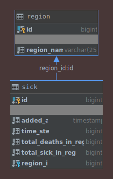

<h1 align="center">
  
  <br>
  Disease history data grabber
</h1>

# Description
This project is a data grabber about covid-19 disease history in Poland.
The idea is to store the evolution of the epidemiology data in the database for the analysis.
The purpose of this project is to learn and test how web scrapping could work. 
Processed data are only for personal research usage, and responsibility of data usage and verification lay down on the users.  
 
Application features: 
- The project derived from Spring-Boot starter.
- The data grabber task is running as a scheduled task using the QUARTZ library.
- <a href="https://jsoup.org/">jsoup</a> used for data parsing.
- Users can set how often the program is running in the properties file.
- As a database, PostgreSQL is used.
- Currently, the program only works with government data sources, possibly adding another interface implementation.

# Data provider
Data provided by Ministry of Health and Chief Sanitary Inspectorate (Ministerstwo Zdrowia oraz Główny Inspektoriat Sanitarny) data presented on 
<a href="https://www.gov.pl/web/koronawirus/wykaz-zarazen-koronawirusem-sars-cov-2">governments website</a>.

In the HTML source between the tag ```<pre></pre>``` there is a JSON with whole data
inside value of the ```"parsedData"```.

```
<pre id="registerData" class="hide">
    {
        "description":"...",
        "parsedData":"..JSON DATA..",
        "fileName":"mapa_woj_1085.csv",
        ...
    }
</pre>
```
This JSON before parsing should be prepared because inside a string there is additional backslash to remove:
- before backslash remove 
```
    {
        \"Województwo\":\"Cała Polska\",
        \"Liczba\":\"1085\",
        \"Liczba zgonów\":\"15\",
        \"Id\":\"t00\"
    }
```
- after cleaning 
```
    {
        "Województwo":"Cała Polska",
        "Liczba":"1085",
        "Liczba zgonów":"15",
        "Id":"t00"
    }
```
# Description of the repository files
- Database scripts: contains database creation sql and useful query's
- Data from the database: contains database tables backup from the test server
- SRC\config: configuration classes to set up scheduler runner and locale  
- SRC\domain: domain classes
- SRC\dto: dto mapping class
- SRC\job: job description classes
- SRC\repo: repository JPA classes
- SRC\service: service classes, data parsing
- SRC\util: utility classes
 from 

## Resources
- application.properties basic app setup:
    - ```application.timezone``` - application works in ```UTC``` timezone
    - ```job.frequency``` - define frequency of the job launching, currently it is 20000 
millisecond which is equal to run every 20 seconds
    - ```data.url.provider``` - link to the web-scrapped data provider
- application.properties postgres database setup:
    - ```spring.datasource.url``` - link to the database
    - ```spring.datasource.username``` - username 
    - ```spring.datasource.password``` - user password
    - ```spring.jpa.show-sql``` - during debug and development set to ```true```, in production set to ```false``` to avoid long outputs in logs
    - ```spring.jpa.hibernate.ddl-auto``` - for development purpose, in production comment this line, we dont want to clean DB during every run
- quartz.properties (see <a href="http://www.quartz-scheduler.org/documentation/quartz-2.3.0/configuration/ConfigMain.html">quartz documentation</a>):
    - ```org.quartz.scheduler.instanceName``` - name of the instance
    - ```org.quartz.scheduler.instanceId``` - value ```AUTO``` mean that the instanceId to be generated automatically
    - ```org.quartz.threadPool.threadCount``` - number of used threads for jobs running, 1 is enough in that case. <a href="http://www.quartz-scheduler.org/documentation/quartz-2.2.2/configuration/ConfigThreadPool.html">Look for more information.<a/>

# Entity relationship diagram
The ER diagram that fits domain classes looks as follows:



# Getting Started

That guidance will get you a copy of the project up and running on your local machine for development and experimentation purposes.

### Prerequisites

```
Java JDK (11+)
Maven
Git
PostgreSQL
Lombok plugin for IDEA
```

### Installing

Cloning project

```
git clone https://github.com/DimaLumelskyj/COVID19-Data-Grabber.git
```

## Deployment

This Spring Boot application can be started in a few ways

Using IDEA

```
Run the main method from Covid19 data scrapper application (Covid19Application.main())
```

Packaging the application as a JAR and run it
```
mvn clean package && java -jar target/covid19-0.0.1-SNAPSHOT.jar
```

Using Maven Spring Boot plugin
```
mvn spring-boot:run
```

## Author
* [Dmytro Lumelskyj] 

Icon made by <a href="https://www.flaticon.com/authors/freepik">Freepik</a> from www.flaticon.com and modified by Dmytro Lumelskyj
